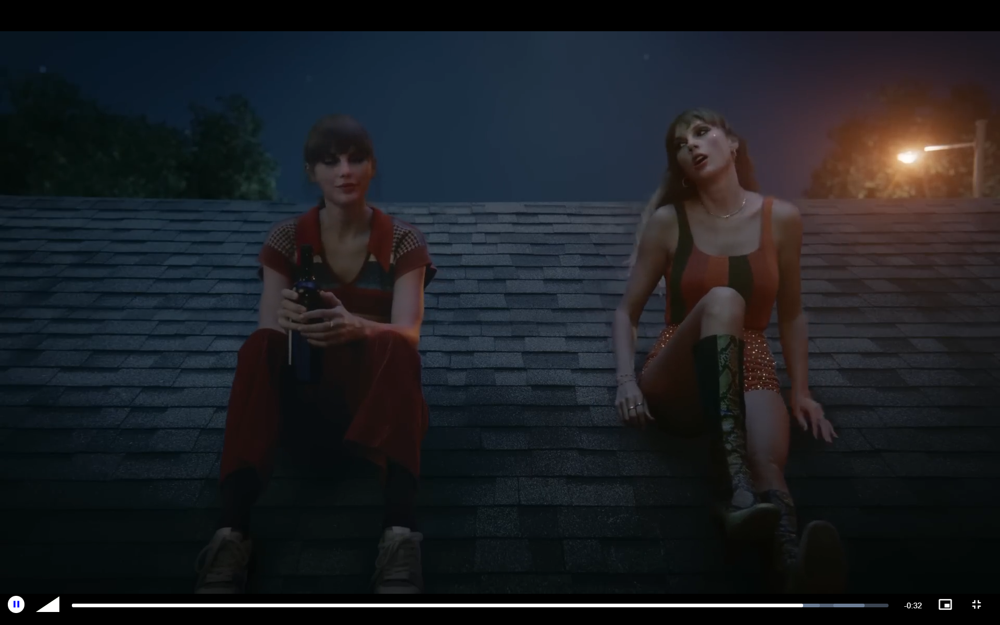

 
= ***PixelBluf***

== Project Status

....
Completed
....

'''

== Features

. Simple Web Video Player Made Using Video.js
. Directly Scan Videos From Folder And Serves Them
. Redis Is Used For Faster Data Access And Efficiently Cached By The Server

'''

== Technology Stack And Tools

[cols="1,1"]
|===
|Name|Version

|Video.js
|8.21.1

|Express
|4.21.2

|Node.js
|23.6.0

|Redis
|Cloud
|===

'''

== Install/Execute

. Setup Database
.. Create A Database At Redis Cloud And Check The Connection String In It.
.. Paste REDIS_PASSWORD And REDIS_HOST In .env File ( Username Is Expected To Be #default#, Unless Edited ).
. Setup Server
.. Install NPM Packages:
[source, bash]
npm i
.. Run Server:
[source, bash]
npm run start

'''

== Special Note

. Edge Cases Have Not Been Addressed Properly, Which Might Cause The App/Server To Crash Unexpectedly
. Codes Are Not Optimised Well, So Higher Resource Consumption And Unexpected Crash Is Expected

'''

== Common Issues

.Video Does Not Appears
[%collapsible]
====
....
Only MP4 Videos Are Scanned By Server. If Video Is MP4, Then Restart The Server As It Scans For Media Only At Start.
....
====

.Video Not Playing, Error Like 'The media could not be loaded, ...' Or Buffering A Lot
[%collapsible]
====
....
Video.js Works Best With H.264 MP4 Videos, Re-encode The Video With FFMpeg. Buffering Issues Can Be Fixed With Reducing Bitrate.
....
====

.Video Buffers A Lot At Start Then Plays
[%collapsible]
====
....
Metadata Is Not Correct Or Not In Start Of The Video, Simply Re-encoding The Video With FFMpeg Will Fix It. 
....
====

.How To Add/Edit Video Data
[%collapsible]
====
....
While Video Is Loaded Press #`# Hotkey On Keyboard. If Time Shows #-:-# Then Close And Play The Video And Open Again.
....
====

'''

== Gallery

====
****

****

****

****

****

****

****

****
====

'''

== Author

....
Mrigayan
....